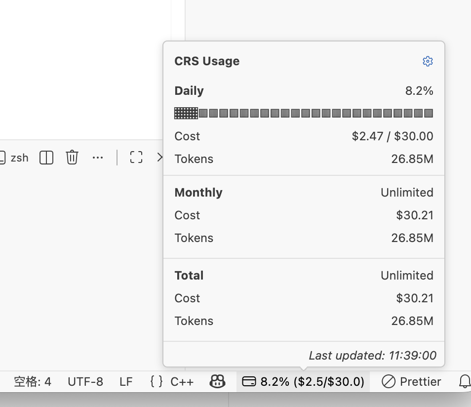

# Claude Relay Service Usage Status

A VS Code extension that displays [Claude Relay Service (CRS)](https://github.com/Wei-Shaw/claude-relay-service) usage information in the status bar.

## Installation

Install through VS Code extensions. Search for `Claude Relay Service Usage Status`.

[Visual Studio Code Market Place: Claude Relay Service Usage Status](https://marketplace.visualstudio.com/items?itemName=SmallMain.vscode-crs-status)

## Usage

1. Click status bar item to open settings.
2. Configure the following required settings:
   - **Base URL**: Your CRS API base URL
   - **API Key**: Your CRS API key

Click the status bar item to manually refresh the usage data.

## Commands

| Command                          | Description                     |
| -------------------------------- | ------------------------------- |
| `CRS Status: Refresh Usage Data` | Manually refresh the usage data |
| `CRS Status: Open Settings`      | Open the extension settings     |

## Configuration

| Setting                           | Type    | Default | Description                                   |
| --------------------------------- | ------- | ------- | --------------------------------------------- |
| `crsStatus.baseUrl`               | string  | `""`    | CRS API Base URL (required)                   |
| `crsStatus.apiKey`                | string  | `""`    | CRS API Key (required)                        |
| `crsStatus.refreshInterval`       | number  | `60`    | Auto-refresh interval in seconds (minimum: 1) |
| `crsStatus.showUsageInStatusBar`  | boolean | `true`  | Show usage percentage in the status bar       |
| `crsStatus.showAmountInStatusBar` | boolean | `true`  | Show cost amounts in the status bar           |

## License

This project is licensed under the MIT License - see the [LICENSE](LICENSE) file for details.

## Contributing

Contributions are welcome! Please feel free to submit a Pull Request.

## Issues

If you encounter any problems or have suggestions, please [open an issue](https://github.com/smallmain/vscode-crs-status/issues).
